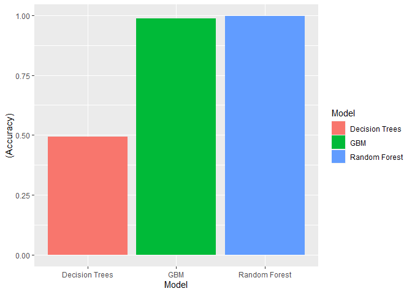

# Human Activity Recognition

## ABSTRACT

Research on activity recognition has traditionally focused on discriminating between different activities, i.e. to predict “which” activity was performed at a specific point in time.

The quality of executing an activity, the “how (well)”, has only received little attention so far, even though it potentially provides useful information for a large variety of applications. In this work it has been defined quality of execution and investigated three aspects that pertain to qualitative activity recognition: specifying correct execution, detecting execution mistakes, providing feedback on the to the user. In two user studies were tried out a sensor- and a model-based approach to qualitative activity recognition.

Results underline the potential of model-based assessment and the positive impact of real-time user feedback on the quality of execution.

Link to the original project:  [Human Activity Recognition](http://groupware.les.inf.puc-rio.br/har)


## Exploratory Analysis

On a first step, data has been analyzed to see if it needs to be reduced since we have 159 columns. We see, if we have a look at the head of the dataset, that there are many variables where most of the values are `NA` or " ", so we will try to identify how many of them are on each variable:


```r
head(training, c(2,4))
```

```
##   user_name raw_timestamp_part_1 raw_timestamp_part_2   cvtd_timestamp
## 1  carlitos           1323084231               788290 05/12/2011 11:23
## 2  carlitos           1323084231               808298 05/12/2011 11:23
```

```r
dim(training)
```

```
## [1] 19622   159
```

```r
NA_missing <- apply(training, 2, function(x) sum(is.na(x)|x==""))
```


Since most of the variables have around 19216 missing or NA values, we will remove them and use as a predictor the variables where we have a full set of data. We will also remove the first 4 columns of the dataset corresponding to the user's name and timestamp since they are variables that won't affect the final model. Finally we convert into a factor the `classe` variable:


```r
training_clean <- training[ , NA_missing < 19000]
training_clean <- training_clean[-c(1:4)]
training_clean$classe <- as.factor(training_clean$classe)
```


Once cleaned the dataset, we proceed to apply several machine learning models to predict the values on the `test` dataset. The first step is to divide the training dataset into `training` and `validation` that will help us to evaluate the performance of the different models before doing  the inference to the test dataset.


```r
inTrain <- createDataPartition(y=training_clean$classe, p=0.7, list=FALSE)
training <- training_clean[inTrain, ]
validation <- training_clean[-inTrain, ]
```


## Training the model

We will use 3 different training models: **Classification and Regression Trees (CART0)**, **Generalized Boosting Model (GMB)** and **Random Forest (RF)**.


### Classification and Regression Trees (`CART`)

In this model, data is classified using decision trees for each of the selected variables.


```r
set.seed(123)
CART <- train(classe ~ ., data = training, method = "rpart")
```


```r
Pred_CART <- predict(CART, newdata = validation)
(CM_CART <- confusionMatrix(Pred_CART, validation$classe))
```

```
## Confusion Matrix and Statistics
## 
##           Reference
## Prediction    A    B    C    D    E
##          A 1519  470  468  459  147
##          B   33  375   39  176  149
##          C  118  294  519  329  295
##          D    0    0    0    0    0
##          E    4    0    0    0  491
## 
## Overall Statistics
##                                           
##                Accuracy : 0.4935          
##                  95% CI : (0.4806, 0.5063)
##     No Information Rate : 0.2845          
##     P-Value [Acc > NIR] : < 2.2e-16       
##                                           
##                   Kappa : 0.3379          
##                                           
##  Mcnemar's Test P-Value : NA              
## 
## Statistics by Class:
## 
##                      Class: A Class: B Class: C Class: D Class: E
## Sensitivity            0.9074  0.32924  0.50585   0.0000  0.45379
## Specificity            0.6333  0.91635  0.78679   1.0000  0.99917
## Pos Pred Value         0.4959  0.48575  0.33376      NaN  0.99192
## Neg Pred Value         0.9451  0.85058  0.88291   0.8362  0.89035
## Prevalence             0.2845  0.19354  0.17434   0.1638  0.18386
## Detection Rate         0.2581  0.06372  0.08819   0.0000  0.08343
## Detection Prevalence   0.5205  0.13118  0.26423   0.0000  0.08411
## Balanced Accuracy      0.7704  0.62279  0.64632   0.5000  0.72648
```


### Generalized Boosting Regression Model with Trees (`GBM`)

These models are a combination of two techniques: decision tree algorithms and boosting methods. Generalized Boosting Models repeatedly fit many decision trees to improve the accuracy of the model. For each new tree in the model, a random subset of all the data is selected using the boosting method.

For this method we will use a 10-Fold cross-validation.


```r
fitControl <- trainControl(method = "repeatedcv", 
                           number = 10)

set.seed(123)
Mod_gbm <- train(classe ~ ., data = training, 
                 method = "gbm",  
                 trControl = fitControl,
                 verbose =FALSE)
```


```r
Pred_GBM <- predict(Mod_gbm, newdata = validation)
(CM_GBM <- confusionMatrix(Pred_GBM, validation$classe))
```

```
## Confusion Matrix and Statistics
## 
##           Reference
## Prediction    A    B    C    D    E
##          A 1673    8    0    0    0
##          B    1 1122   11    1    2
##          C    0    7 1008   15    3
##          D    0    2    6  945   13
##          E    0    0    1    3 1064
## 
## Overall Statistics
##                                           
##                Accuracy : 0.9876          
##                  95% CI : (0.9844, 0.9903)
##     No Information Rate : 0.2845          
##     P-Value [Acc > NIR] : < 2.2e-16       
##                                           
##                   Kappa : 0.9843          
##                                           
##  Mcnemar's Test P-Value : NA              
## 
## Statistics by Class:
## 
##                      Class: A Class: B Class: C Class: D Class: E
## Sensitivity            0.9994   0.9851   0.9825   0.9803   0.9834
## Specificity            0.9981   0.9968   0.9949   0.9957   0.9992
## Pos Pred Value         0.9952   0.9868   0.9758   0.9783   0.9963
## Neg Pred Value         0.9998   0.9964   0.9963   0.9961   0.9963
## Prevalence             0.2845   0.1935   0.1743   0.1638   0.1839
## Detection Rate         0.2843   0.1907   0.1713   0.1606   0.1808
## Detection Prevalence   0.2856   0.1932   0.1755   0.1641   0.1815
## Balanced Accuracy      0.9988   0.9910   0.9887   0.9880   0.9913
```


### Random Forest

**Random forests** are an ensemble learning method for classification, regression and other tasks that operate by constructing a multitude of decision trees at training time and outputting the class that is the mode of the classes (classification) or mean/average prediction (regression) of the individual trees.


```r
set.seed(123)
Mod_RF <- train(classe ~ ., data = training, method = "rf")
```

```
## Warning: model fit failed for Resample01: mtry= 2 Error : cannot allocate vector of size 104.8 Mb
```

```
## Warning: model fit failed for Resample01: mtry=28 Error : cannot allocate vector of size 104.8 Mb
```

```
## Warning: model fit failed for Resample01: mtry=54 Error : cannot allocate vector of size 104.8 Mb
```

```
## Warning: model fit failed for Resample02: mtry= 2 Error : cannot allocate vector of size 104.8 Mb
```

```
## Warning: model fit failed for Resample02: mtry=28 Error : cannot allocate vector of size 104.8 Mb
```

```
## Warning: model fit failed for Resample02: mtry=54 Error : cannot allocate vector of size 104.8 Mb
```

```
## Warning: model fit failed for Resample03: mtry= 2 Error : cannot allocate vector of size 104.8 Mb
```

```
## Warning: model fit failed for Resample03: mtry=28 Error : cannot allocate vector of size 104.8 Mb
```

```
## Warning in nominalTrainWorkflow(x = x, y = y, wts = weights, info = trainInfo, :
## There were missing values in resampled performance measures.
```


```r
Pred_RF <- predict(Mod_RF, newdata= validation)
(CM_RF <- confusionMatrix(Pred_RF, validation$classe))
```

```
## Confusion Matrix and Statistics
## 
##           Reference
## Prediction    A    B    C    D    E
##          A 1674    0    0    0    0
##          B    0 1138    7    0    2
##          C    0    0 1019    3    0
##          D    0    1    0  961    8
##          E    0    0    0    0 1072
## 
## Overall Statistics
##                                           
##                Accuracy : 0.9964          
##                  95% CI : (0.9946, 0.9978)
##     No Information Rate : 0.2845          
##     P-Value [Acc > NIR] : < 2.2e-16       
##                                           
##                   Kappa : 0.9955          
##                                           
##  Mcnemar's Test P-Value : NA              
## 
## Statistics by Class:
## 
##                      Class: A Class: B Class: C Class: D Class: E
## Sensitivity            1.0000   0.9991   0.9932   0.9969   0.9908
## Specificity            1.0000   0.9981   0.9994   0.9982   1.0000
## Pos Pred Value         1.0000   0.9922   0.9971   0.9907   1.0000
## Neg Pred Value         1.0000   0.9998   0.9986   0.9994   0.9979
## Prevalence             0.2845   0.1935   0.1743   0.1638   0.1839
## Detection Rate         0.2845   0.1934   0.1732   0.1633   0.1822
## Detection Prevalence   0.2845   0.1949   0.1737   0.1648   0.1822
## Balanced Accuracy      1.0000   0.9986   0.9963   0.9975   0.9954
```


## Summary of the different models


```r
Methods_summary <- as.data.frame(matrix(c("Decision Trees", round(CM_CART$overall[1:2],4),
                            "GBM",round(CM_GBM$overall[1:2],4), 
                          "Random Forest",round(CM_RF$overall[1:2],4)), byrow = T, nr=3))
colnames(Methods_summary) <- c("Model","Accuracy", "Kappa")
Methods_summary[2:3] <- apply(Methods_summary[2:3], 2, as.numeric)
Methods_summary$Error <- round(1 - Methods_summary$Accuracy,4)
Methods_summary %>% kbl() %>% kable_styling()
```

<table class="table" style="margin-left: auto; margin-right: auto;">
 <thead>
  <tr>
   <th style="text-align:left;"> Model </th>
   <th style="text-align:right;"> Accuracy </th>
   <th style="text-align:right;"> Kappa </th>
   <th style="text-align:right;"> Error </th>
  </tr>
 </thead>
<tbody>
  <tr>
   <td style="text-align:left;"> Decision Trees </td>
   <td style="text-align:right;"> 0.4935 </td>
   <td style="text-align:right;"> 0.3379 </td>
   <td style="text-align:right;"> 0.5065 </td>
  </tr>
  <tr>
   <td style="text-align:left;"> GBM </td>
   <td style="text-align:right;"> 0.9876 </td>
   <td style="text-align:right;"> 0.9843 </td>
   <td style="text-align:right;"> 0.0124 </td>
  </tr>
  <tr>
   <td style="text-align:left;"> Random Forest </td>
   <td style="text-align:right;"> 0.9964 </td>
   <td style="text-align:right;"> 0.9955 </td>
   <td style="text-align:right;"> 0.0036 </td>
  </tr>
</tbody>
</table>


```r
ggplot(Methods_summary[,1:2], aes(x=Model, y=(Accuracy))) + 
  geom_bar(stat = 'identity', aes(fill=Model))
```

<!-- -->

From the table and the plot, we observe that the **error** for **Decision Trees** is around **48%**, **2%** for **GBM** and **0.4%** for **Random Forest**.

## Test dataset evaluation

Once trained and tested the model with the training/validation datasets, we will inference the `classe` values for the 20 values at test dataset. Since both, Random Forest and GBM are similar in Accuracy, close to 100%, we will use them both for the classification.


```r
(Pred_test_RF <- predict(Mod_RF, newdata = testing))
```

```
##  [1] B A B A A E D B A A B C B A E E A B B B
## Levels: A B C D E
```

```r
(Pred_test_GBM <- predict(Mod_gbm, newdata = testing))
```

```
##  [1] B A B A A E D B A A B C B A E E A B B B
## Levels: A B C D E
```


As we can observe, with this two models we have identical results.


